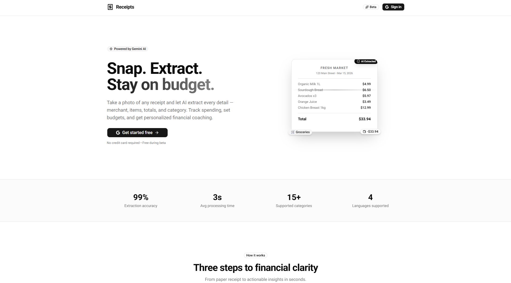
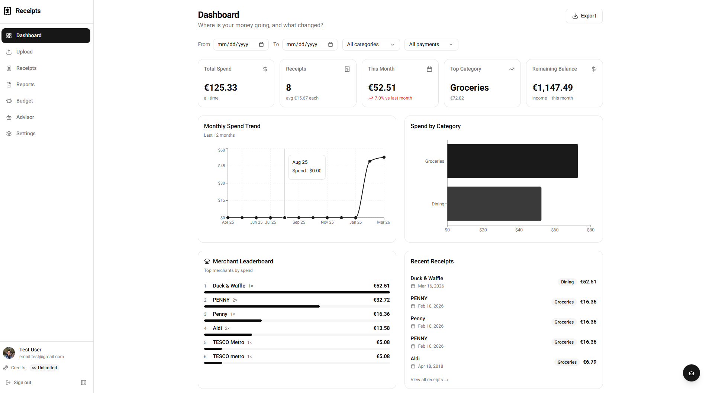
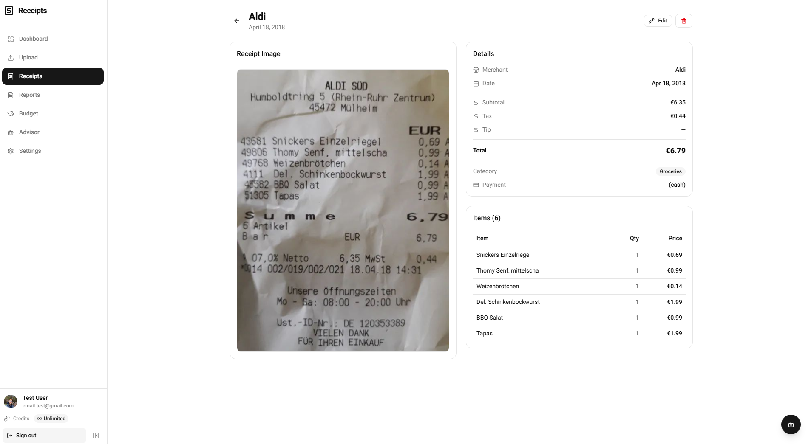
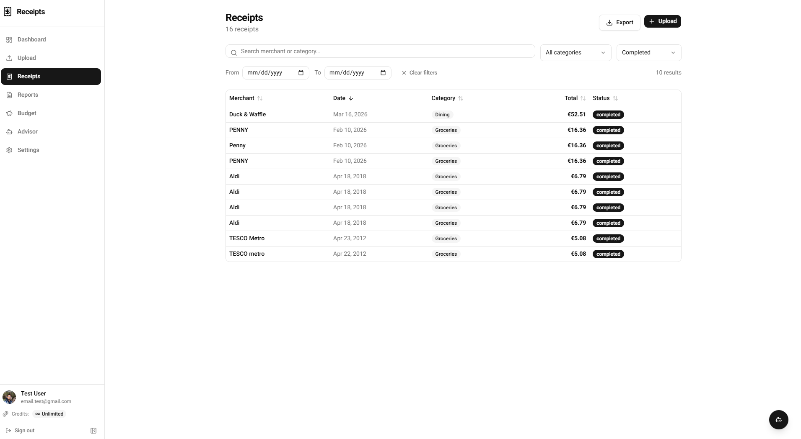
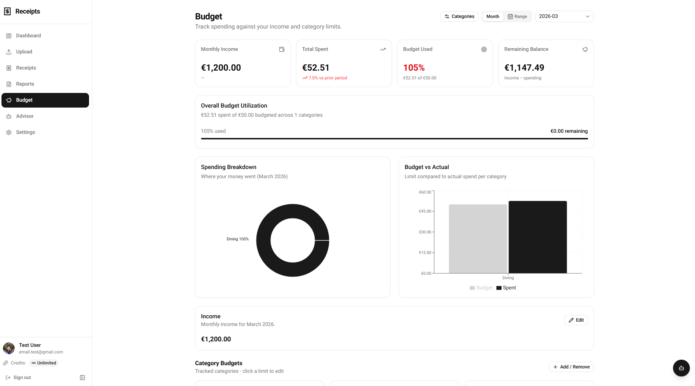
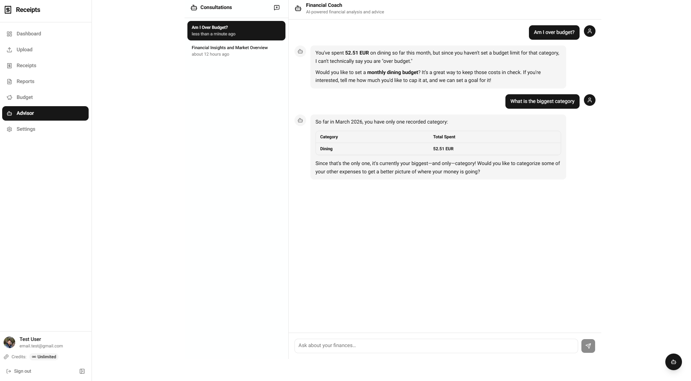
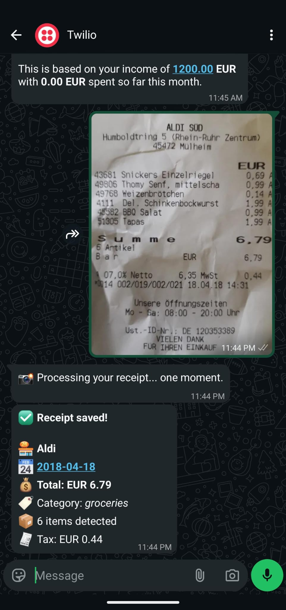
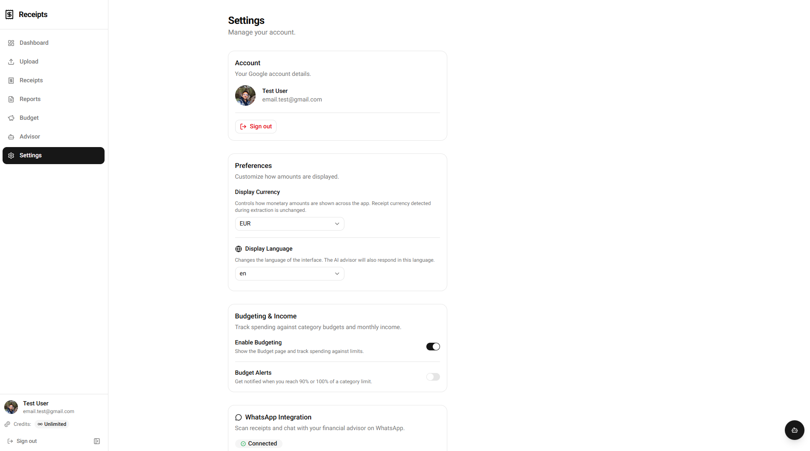

<div align="center">

# 🧾 Receipt Saver

**AI-powered receipt scanning, budgeting, and financial coaching.**

Snap a photo. Extract every detail. Stay on budget.

[](https://nextjs.org)
[](https://react.dev)
[](https://firebase.google.com)
[](https://ai.google.dev)
[](https://cloud.google.com/run)
[](https://cloud.google.com/storage)
[](https://cloud.google.com/build)
[](https://www.twilio.com/whatsapp)
[](https://tailwindcss.com)
[]()

[Live Demo](https://receipt-saver-cucgfghe4q-ew.a.run.app) · [Report Bug](#) · [Request Feature](#)

</div>

---

## 📸 Screenshots

<!-- Replace the placeholder paths below with your actual screenshot images -->

<div align="center">
TO DO 
| Landing Page | Dashboard |
|:---:|:---:|
|  |  |

| Receipt Scan | Receipt Detail |
|:---:|:---:|
|  |  |

| Budget Tracking | AI Financial Coach |
|:---:|:---:|
|  |  |

| WhatsApp Integration | Settings |
|:---:|:---:|
|  |  |

</div>

---

## ✨ Features

### 🤖 AI Receipt Extraction
- **Snap & extract** — Take a photo of any receipt and Gemini AI extracts merchant, date, items, prices, tax, tip, total, currency, payment method, and category
- **Multi-page merge** — Upload multiple images of a long receipt; they get merged into a single record
- **Smart categorization** — Automatic categorization into 15+ categories (groceries, dining, transport, etc.)
- **99% accuracy** — Powered by Gemini 3 Flash for fast, reliable extraction

### 💰 Smart Budgeting
- **Per-category limits** — Set monthly spending limits for any category
- **Real-time tracking** — Visual progress bars with percentage utilization
- **Budget alerts** — Notifications when reaching 90% or 100% of a limit
- **Custom date ranges** — Analyze spending for any period, not just the current month
- **Income tracking** — Log monthly income and see remaining balance

### 🧠 AI Financial Coach
- **Natural language queries** — Ask "How much did I spend on dining this month?" and get real answers
- **Data-driven advice** — The AI analyzes your real spending data before responding
- **Goal setting** — AI suggests personalized savings goals; agree and they're saved instantly
- **Goal management** — List, track, and remove goals through conversation
- **Function calling** — 6 AI tools (monthly summary, receipt search, budget status, commit/list/remove goals)
- **Conversation history** — All chats are saved and browsable

### 📱 WhatsApp Integration
- **Scan via messaging** — Send a receipt photo on WhatsApp and it's scanned & saved automatically
- **Chat with your advisor** — Ask financial questions directly from WhatsApp
- **No app needed** — Works from any phone with WhatsApp, no install required
- **Twilio-powered** — Reliable delivery via Twilio WhatsApp Business API

### 📊 Reports & Export
- **Custom reports** — Create reports with date range and category filters
- **PDF export** — Generate professional PDF reports for tax season
- **CSV export** — Download receipt data as spreadsheets

### 🌐 Multi-language
- **4 languages** — English, French, German, and Arabic
- **RTL support** — Full right-to-left layout for Arabic
- **AI responds in your language** — The financial coach adapts to your locale

### 🔐 Security
- **Google authentication** — Sign in with your Google account
- **Beta gating** — Email allowlist for controlled access
- **Firestore security rules** — Users can only access their own data
- **No data sharing** — Your financial data is never shared or used for training

---

## 🏗️ Tech Stack

| Layer | Technology |
|:---|:---|
| **Framework** | [Next.js 16](https://nextjs.org) (App Router, Turbopack) |
| **Frontend** | [React 19](https://react.dev), [Tailwind CSS 4](https://tailwindcss.com), [shadcn/ui](https://ui.shadcn.com) |
| **AI** | [Google Gemini](https://ai.google.dev) (3 Flash for extraction, 3.1 Flash Lite for advisor) |
| **Auth** | [Firebase Authentication](https://firebase.google.com/docs/auth) (Google sign-in) |
| **Database** | [Cloud Firestore](https://firebase.google.com/docs/firestore) |
| **Storage** | [Google Cloud Storage](https://cloud.google.com/storage) |
| **Messaging** | [Twilio WhatsApp API](https://www.twilio.com/whatsapp) |
| **i18n** | [next-intl](https://next-intl-docs.vercel.app) (4 locales) |
| **Charts** | [Recharts](https://recharts.org) |
| **Image Processing** | [Sharp](https://sharp.pixelplumbing.com) |
| **PDF Generation** | [pdf-lib](https://pdf-lib.js.org) |
| **Hosting** | [Google Cloud Run](https://cloud.google.com/run) (europe-west1) |
| **CI/CD** | [Google Cloud Build](https://cloud.google.com/build) |

---

## 📁 Project Structure

```
src/
├── app/
│   ├── [locale]/                    # i18n routing (en, fr, de, ar)
│   │   ├── (authenticated)/         # Protected pages
│   │   │   ├── dashboard/           # Main dashboard with charts
│   │   │   ├── upload/              # Receipt upload with drag & drop
│   │   │   ├── receipts/            # Receipt list + [id] detail
│   │   │   ├── reports/             # Reports management
│   │   │   ├── budget/              # Budget tracking & visualization
│   │   │   ├── advisor/             # AI financial coach (full page)
│   │   │   └── settings/            # User preferences & WhatsApp linking
│   │   └── page.js                  # Landing page / redirect
│   └── api/
│       ├── user/                    # User profile & preferences
│       ├── receipts/                # CRUD, upload, export (CSV/PDF)
│       ├── reports/                 # Report CRUD
│       ├── budget/                  # Income, limits, categories, check
│       ├── ai/                      # Advisor, chats, goals
│       └── whatsapp/                # Webhook + phone linking
├── components/
│   ├── ui/                          # shadcn/ui components
│   ├── landing-page.jsx             # Public landing page
│   ├── sidebar.jsx                  # Collapsible navigation
│   ├── advisor-chat.jsx             # AI chat component
│   ├── ai-floating-button.jsx       # Floating AI chat sheet
│   └── ...                          # Auth, currency, budget providers
├── lib/
│   ├── firebase-admin.js            # Lazy-init Firebase Admin SDK
│   ├── auth.js                      # Server-side auth verification
│   ├── gemini.js                    # Gemini AI receipt extraction
│   ├── storage.js                   # GCS upload/download/signed URLs
│   ├── image.js                     # Sharp image compression
│   ├── credits.js                   # Credit system management
│   ├── phone-links.js               # WhatsApp phone-to-user mapping
│   └── ...
├── messages/                        # Translation files (en, fr, de, ar)
└── i18n/                            # next-intl config & routing
```

---

## 🚀 Getting Started

### Prerequisites

- **Node.js** 22+ and **npm**
- A [Firebase project](https://console.firebase.google.com) with Authentication and Firestore enabled
- A [Google Cloud project](https://console.cloud.google.com) with a service account
- A [Gemini API key](https://ai.google.dev)
- *(Optional)* A [Twilio account](https://www.twilio.com) for WhatsApp integration

### 1. Clone the repository

```bash
git clone https://github.com/yourusername/receipt-saver.git
cd receipt-saver
```

### 2. Install dependencies

```bash
npm install
```

### 3. Configure environment variables

Create a `.env.local` file in the project root:

```env
# Firebase Client SDK (public)
NEXT_PUBLIC_FIREBASE_API_KEY=your_api_key
NEXT_PUBLIC_FIREBASE_AUTH_DOMAIN=your_project.firebaseapp.com
NEXT_PUBLIC_FIREBASE_PROJECT_ID=your_project_id
NEXT_PUBLIC_FIREBASE_STORAGE_BUCKET=your_project.firebasestorage.app
NEXT_PUBLIC_FIREBASE_MESSAGING_SENDER_ID=your_sender_id
NEXT_PUBLIC_FIREBASE_APP_ID=your_app_id
NEXT_MEASUREMENT_ID=G-XXXXXXXXXX

# Google Cloud (server-side)
GOOGLE_CLOUD_PROJECT_ID=your_project_id
GOOGLE_CLOUD_STORAGE_BUCKET=your_bucket_name
GOOGLE_APPLICATION_CREDENTIALS=/path/to/service-account-key.json

# Gemini AI
GOOGLE_GEMINI_API_KEY=your_gemini_api_key

# Access control (comma-separated emails)
UNLIMITED_EMAILS=user1@gmail.com,user2@gmail.com
NEXT_PUBLIC_ALLOWED_EMAILS=user1@gmail.com,user2@gmail.com

# Twilio WhatsApp (optional)
TWILIO_ACCOUNT_SID=your_sid
TWILIO_AUTH_TOKEN=your_token
TWILIO_WHATSAPP_NUMBER=whatsapp:+14155238886
```

### 4. Run the development server

```bash
npm run dev
```

Open [http://localhost:3000](http://localhost:3000) in your browser.

---

## 🐳 Deployment (Google Cloud Run)

The project includes a one-command deploy script:

```bash
# Authenticate with GCP
gcloud auth login
gcloud config set project your-project-id

# Deploy
./deploy.sh
```

This will:
1. Build a Docker image via **Cloud Build** (multi-stage, ~150MB final image)
2. Deploy to **Cloud Run** in `europe-west1`
3. Set all runtime environment variables
4. Print the live URL

### Post-deployment checklist

- [ ] Add Cloud Run domain to **Firebase Auth → Authorized domains**
- [ ] Grant the service account: `Cloud Datastore User`, `Storage Object Admin`, `Service Account Token Creator`
- [ ] Update **Twilio WhatsApp sandbox** webhook URL to `https://your-url/api/whatsapp/webhook`

---

## 🔌 API Routes

| Method | Route | Description |
|:---|:---|:---|
| `GET/PATCH` | `/api/user` | User profile & preferences |
| `GET` | `/api/receipts` | List receipts with filters |
| `POST` | `/api/receipts/upload` | Upload & extract receipt(s) |
| `GET/PATCH/DELETE` | `/api/receipts/[id]` | Receipt CRUD |
| `GET` | `/api/receipts/export/csv` | Export receipts as CSV |
| `GET` | `/api/receipts/export/pdf` | Export receipts as PDF |
| `GET/POST` | `/api/reports` | List & create reports |
| `GET/DELETE` | `/api/reports/[id]` | Report detail & delete |
| `GET/POST` | `/api/budget/income` | Monthly income |
| `GET/POST` | `/api/budget/limits` | Category budget limits |
| `GET/POST` | `/api/budget/categories` | Tracked categories |
| `GET` | `/api/budget/check` | Budget alert check |
| `POST` | `/api/ai/advisor` | AI chat with function calling |
| `GET` | `/api/ai/chats` | List chat conversations |
| `GET/DELETE` | `/api/ai/chats/[id]` | Chat detail & delete |
| `GET` | `/api/ai/goals` | Financial goals |
| `GET/POST/DELETE` | `/api/whatsapp/link` | WhatsApp phone linking |
| `POST/GET` | `/api/whatsapp/webhook` | Twilio webhook handler |

---

## 🌍 Supported Languages

| Language | Code | Direction |
|:---|:---|:---|
| English | `en` | LTR |
| French | `fr` | LTR |
| German | `de` | LTR |
| Arabic | `ar` | RTL |

---

## 📄 License

This project is private and not open-source.

---

<div align="center">

**Built with ❤️ using Next.js, Firebase & Gemini AI**

**Powered by Google Cloud Platform**

</div>
